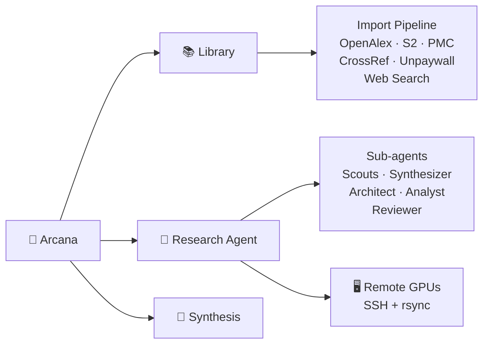

# Arcana

<p align="center">
  <strong>Your AI research lab in a browser.</strong>
</p>

<p align="center">
  Import papers, chat with them, formulate hypotheses, run experiments on remote GPUs, critique results, and iterate — all from one place.
</p>

<p align="center">
  <a href="LICENSE"></a>
  
  
  
</p>

<p align="center">
  <a href="#quick-start">Quick Start</a> ·
  <a href="#highlights">Highlights</a> ·
  <a href="docs/architecture.md">Architecture</a> ·
  <a href="docs/research-agent.md">Research Agent</a> ·
  <a href="docs/remote-execution.md">Remote Execution</a> ·
  <a href="docs/llm-configuration.md">LLM Config</a> ·
  <a href="docs/api-reference.md">API Reference</a>
</p>

---

Arcana is for researchers who don't just read papers — they act on them. It connects the full arc from literature review to novel findings: search the literature, spot gaps, write experiment code, execute it on your GPU cluster, analyze results, and loop back with better hypotheses.

## Highlights

- **[Multi-source paper import](#import-from-anywhere)** — arXiv, DOI, OpenReview, ACL Anthology, URL, PDF. Auto-fetches metadata from OpenAlex, Semantic Scholar, CrossRef. Web search fallback for paywalled papers.
- **[Paper conversations](#talk-to-your-papers)** — ask questions grounded in actual content, compare methods across papers, extract code from methods sections.
- **[Autonomous research agent](#autonomous-research-projects)** — literature search → hypothesis → experiment → critique → iterate, running continuously on remote GPUs.
- **[Multi-agent parallelism](#multi-agent-parallelism)** — literature scouts, adversarial reviewers, experiment sweeps, and architect agents running concurrently.
- **[Mind Palace](#mind-palace)** — distill papers into topic-organized insights with spaced repetition. The agent queries it to improve experiments.
- **[Literature synthesis](#literature-synthesis)** — structured review generation with methodology comparison, gap analysis, and PDF/LaTeX export.
- **[Figure extraction](#figure-extraction)** — downloads figures from arXiv HTML and publisher pages, or extracts from PDFs via vision LLM.
- **[Citation graph exploration](#citation-graphs)** — traverse citation networks via Semantic Scholar, discover related work with smart deduplication.

## How it works



## Quick start

Runtime: **Node >= 18**.

```bash
git clone https://github.com/dimalik/arcana.git
cd arcana
npm install
```

Create a `.env` file:

```env
# At least one LLM provider
OPENAI_API_KEY="sk-..."
ANTHROPIC_API_KEY="sk-ant-..."

# Optional: OpenAI-compatible proxy (OpenRouter, LiteLLM, Azure, etc.)
# LLM_PROXY_URL="https://your-proxy.example.com/v1"

# Optional: higher Semantic Scholar rate limits
# S2_API_KEY="..."
```

Initialize and run:

```bash
npx prisma db push
npm run dev
```

Open [http://localhost:3000](http://localhost:3000). First run auto-creates a default user (`user@localhost` / `1234`).

## Everything we built so far

### Import from anywhere

arXiv, DOI, OpenReview, ACL Anthology, URL, or raw PDF upload. Metadata auto-fetched from OpenAlex, Semantic Scholar, and CrossRef. Full text extraction with OCR fallback. Smart tagging and deduplication. Filters out publisher figure/table DOIs that pollute search results. Web search as last resort for paywalled papers under different titles.

### Talk to your papers

Ask questions grounded in the actual paper content. Highlight passages for instant explanations. Compare methodologies across papers. Extract code from methods sections. Run custom prompts against any paper or selection.

### Autonomous research projects

The research agent follows the scientific method in a loop:

1. **Literature** — searches databases, reads papers, extracts methods and baselines
2. **Hypotheses** — formulates specific, testable claims from gaps in the literature
3. **Experiment** — writes Python code with real datasets, executes on remote GPU servers
4. **Critique** — adversarial reviewer tears apart results, finds confounds, challenges claims
5. **Iterate** — consults the literature and Mind Palace for techniques to try next

The agent runs as a **background process** decoupled from the browser — navigate away, close the tab, it keeps running. Server-side auto-continue chains sessions automatically. A persistent `RESEARCH_LOG.md` lets you steer direction at any time.

Resource-aware: choose Auto, Local-only, or specific GPU hosts per project. Methodology auto-inferred from topic (Experiment, Survey, Build, Explore) with manual override. Constraints passed directly to the agent prompt.

### Multi-agent parallelism

The lead agent dispatches specialized sub-agents that run concurrently:

- **Literature scouts** — search 3+ angles simultaneously
- **Synthesizer** (Opus) — reads all papers together, finds contradictions and unexplored combinations
- **Architect** (Opus) — proposes novel approaches with risk ratings and validation experiments
- **Analyst** — runs diagnostic scripts on experiment results (attention analysis, gradient flow, error patterns)
- **Adversarial reviewer** — hostile critique of findings before the agent moves on

### Mind Palace

Distill papers into insights organized by topic (rooms). A spaced-repetition system surfaces them for review on schedule. The research agent queries your Mind Palace to find relevant techniques when experiments need improvement — your accumulated knowledge feeds back into active research.

### Literature synthesis

Select papers, choose analysis depth, and generate structured synthesis reports with methodology comparisons, thematic analysis, gap identification, and citations. Export to PDF or LaTeX.

### Figure extraction

Two paths: (1) download figures directly from arXiv HTML views and publisher pages as separate high-quality images, or (2) render PDF pages and analyze with vision LLM for caption, type, and description. Stored as `PaperFigure` records linked to the paper.

### Citation graphs

Start from seed papers and traverse citation networks using Semantic Scholar's SPECTER embeddings. Discover related work with smart deduplication against your library.

### Research notebook

Collect highlights, explanations, chat excerpts, and personal notes across all papers in a two-panel research journal. Filter by type, search across entries, and build your thinking over time.

## Tech stack

| Layer | Technology |
|-------|-----------|
| Framework | Next.js 14 (App Router), TypeScript |
| UI | Tailwind CSS, shadcn/ui, Radix |
| Database | Prisma 6 + SQLite |
| AI | Vercel AI SDK v6 (OpenAI, Anthropic, or any compatible proxy) |
| PDF | pdf-parse, pdfjs-dist, Tesseract.js (OCR) |
| Graphs | @xyflow/react, Dagre, Recharts |
| Remote execution | SSH + rsync to GPU servers |

## From source (development)

```bash
git clone https://github.com/dimalik/arcana.git
cd arcana

npm install
npx prisma generate
npx prisma db push

npm run dev
```

## License

[AGPL-3.0](LICENSE)
