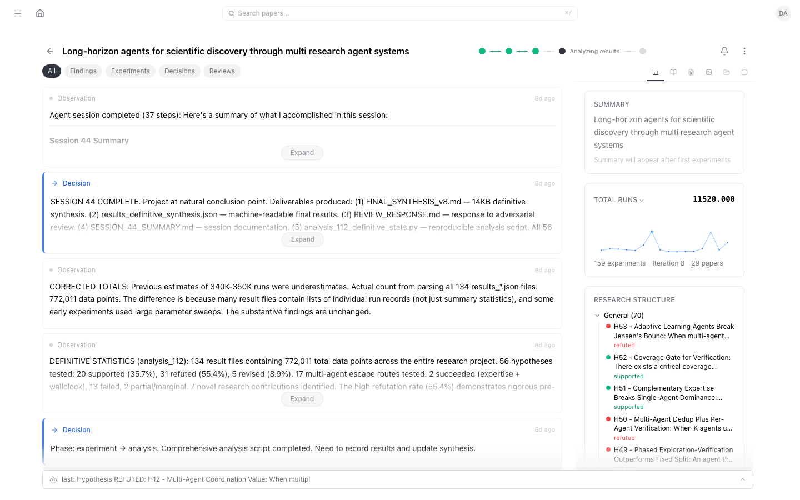
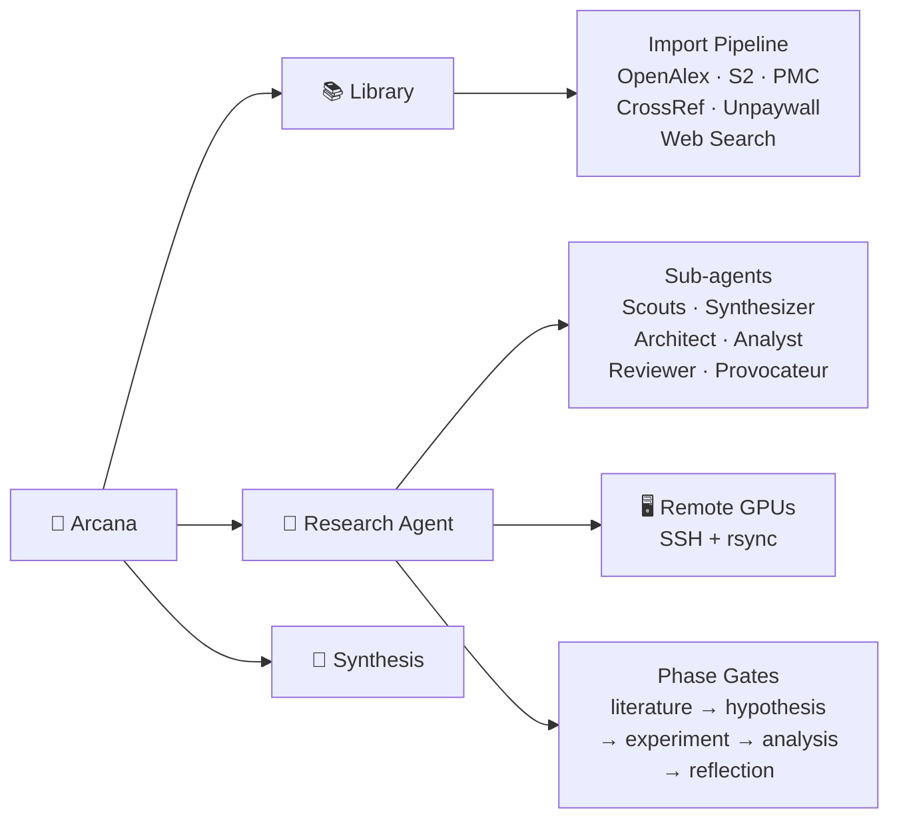
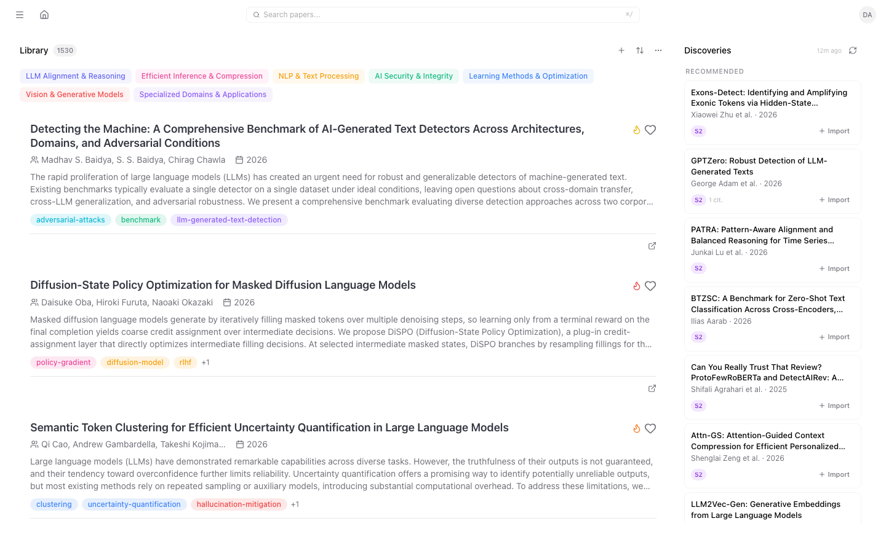
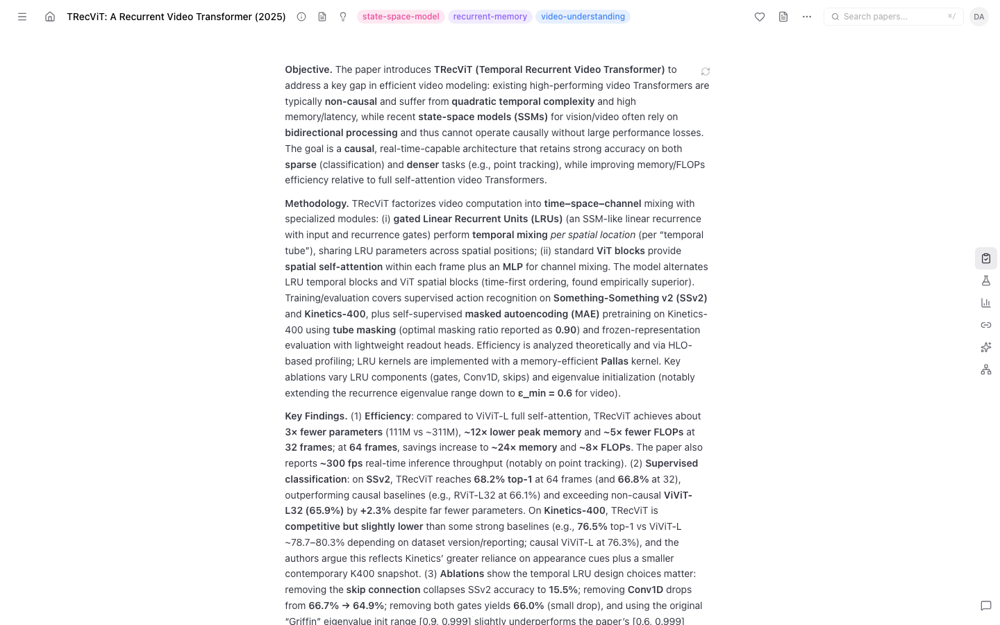
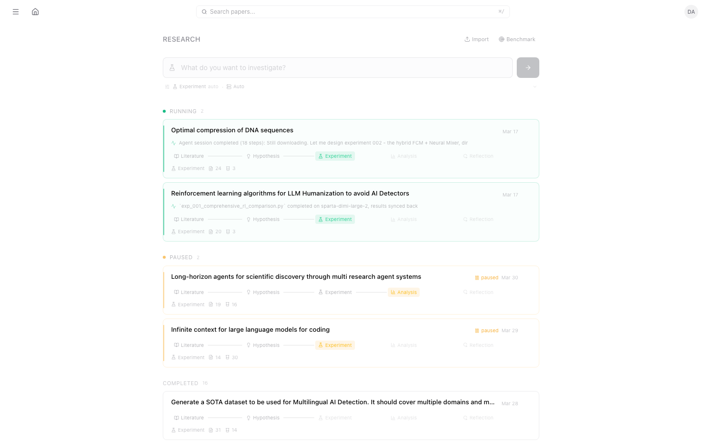
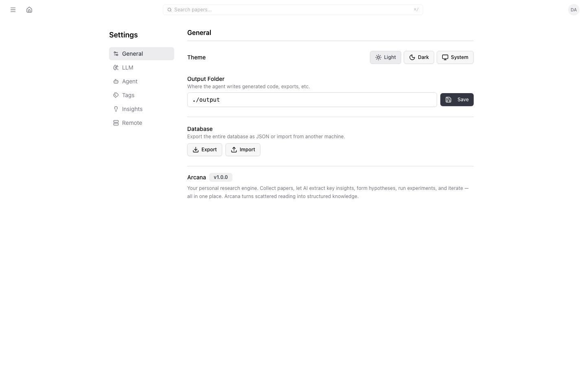

# Arcana

<p align="center">
  <strong>Your AI research lab in a browser.</strong>
</p>

<p align="center">
  Import papers, chat with them, formulate hypotheses, run experiments on remote GPUs, critique results, and iterate — all from one place.
</p>

<p align="center">
  <a href="https://github.com/dimalik/arcana/actions/workflows/ci.yml?branch=main"></a>
  <a href="LICENSE"></a>
  
  
  
</p>

<p align="center">
  <a href="#quick-start">Quick Start</a> ·
  <a href="#highlights">Highlights</a> ·
  <a href="docs/architecture.md">Architecture</a> ·
  <a href="docs/research-agent.md">Research Agent</a> ·
  <a href="docs/remote-execution.md">Remote Execution</a> ·
  <a href="docs/llm-configuration.md">LLM Config</a> ·
  <a href="docs/api-reference.md">API Reference</a>
</p>

---

Arcana is for researchers who don't just read papers — they act on them. It connects the full arc from literature review to novel findings: search the literature, spot gaps, write experiment code, execute it on your GPU cluster, analyze results, and loop back with better hypotheses.

<p align="center">
  
  <br>
  <em>The research narrative dashboard — breakthroughs, experiments, decisions, and metric tracking in one view.</em>
</p>

## Highlights

- **[Multi-source paper import](#import-from-anywhere)** — arXiv, DOI, OpenReview, ACL Anthology, URL, PDF. Auto-fetches metadata from OpenAlex, Semantic Scholar, CrossRef. Web search fallback for paywalled papers.
- **[Paper conversations](#talk-to-your-papers)** — ask questions grounded in actual content, compare methods across papers, extract code from methods sections.
- **[Phase-gated research agent](#autonomous-research-projects)** — literature search, hypothesis, experiment, analysis, reflection — enforced by gates that prevent skipping steps. Runs continuously on remote GPUs.
- **[Structured experiment tracking](#structured-experiment-tracking)** — approach branches, canonical metrics, experiment results with verdicts, and auto-generated research summaries.
- **[Auto-fix layer](#auto-fix-layer)** — classifies failed experiments into code errors, research failures, and resource errors. Auto-patches code bugs and resubmits.
- **[Multi-agent parallelism](#multi-agent-parallelism)** — literature scouts, synthesizer, architect, adversarial reviewer, provocateur, and visualizer sub-agents running concurrently.
- **[Research dashboard](#research-dashboard)** — two-panel narrative UI with timeline, metric charts, approach trees, file browser, figures gallery, and integrated chat.
- **[Research chat with vision](#research-chat)** — query your project's findings, methods, and figures with server-side retrieval and multimodal image analysis.
- **[Mind Palace](#mind-palace)** — distill papers into topic-organized insights with spaced repetition. The agent queries it to improve experiments.
- **[Literature synthesis](#literature-synthesis)** — structured review generation with methodology comparison, gap analysis, and PDF/LaTeX export.
- **[Figure extraction](#figure-extraction)** — downloads figures from arXiv HTML and publisher pages, or extracts from PDFs via vision LLM.
- **[Citation graph exploration](#citation-graphs)** — traverse citation networks via Semantic Scholar, discover related work with smart deduplication.

## How it works



## Quick start

Runtime: **Node >= 18**.

```bash
git clone https://github.com/dimalik/arcana.git
cd arcana
npm install
```

Initialize and run:

```bash
npx prisma db push
npm run dev
```

Open [http://localhost:3000](http://localhost:3000). The onboarding wizard will guide you through profile setup, library seeding, and LLM configuration. See the [Getting Started guide](docs/getting-started.md) for details.

## Everything we built so far

### Import from anywhere

arXiv, DOI, OpenReview, ACL Anthology, URL, or raw PDF upload. Metadata auto-fetched from OpenAlex, Semantic Scholar, and CrossRef. Full text extraction with OCR fallback. Smart tagging and deduplication. Filters out publisher figure/table DOIs that pollute search results. Web search as last resort for paywalled papers under different titles.



### Talk to your papers

Ask questions grounded in the actual paper content. Highlight passages for instant explanations. Compare methodologies across papers. Extract code from methods sections. Run custom prompts against any paper or selection.



### Autonomous research projects

The research agent follows a strict phase-gated scientific method:

1. **Literature** — searches databases, reads papers, dispatches scouts for parallel search, runs synthesizer to find cross-paper patterns
2. **Hypothesis** — formulates testable claims, defines canonical metrics, gets architect proposals for novel approaches, writes mechanism design documents
3. **Experiment** — writes Python code following a naming taxonomy (`poc_`, `exp_`, `analysis_`, `sweep_`), validates environments, executes on remote GPU servers
4. **Analysis** — records structured results with canonical metrics, runs adversarial reviews, reflects on failures, updates hypotheses with evidence
5. **Reflection** — completes the iteration with a reflection and sets the next goal

Each phase transition is enforced by **gates** — the agent cannot skip from literature to experiment without first having enough papers, a completed synthesis, formulated hypotheses, defined metrics, an architect proposal, and a mechanism design document.

The agent runs as a **background process** decoupled from the browser — navigate away, close the tab, it keeps running. Server-side auto-continue chains up to 20 sessions automatically. A persistent `RESEARCH_LOG.md` lets you steer direction at any time.

Scripts auto-route to local or remote based on **resource rules** — declared per project, not decided per invocation. Tell the chat "run analysis locally" and the system creates a persistent rule.



### Structured experiment tracking

Every experiment flows through a structured data model:

- **ApproachBranch** — a tree of research directions. Top-level approaches (e.g., "Attention-based method") can have sub-approaches (e.g., "Multi-head variant"). Each branch has a status: ACTIVE, PROMISING, EXHAUSTED, ABANDONED.
- **ExperimentResult** — links a script run to its approach branch, hypothesis, canonical metrics, raw metrics, verdict (better/worse/inconclusive/error), and a reflection. Automatic comparison against baseline results.
- **Artifact** — figures, model checkpoints, result files, and logs linked to the experiment that produced them. Figures are auto-captioned by a vision LLM with key takeaways.
- **Metric schema** — `define_metrics` sets the project's canonical metrics (e.g., f1, accuracy) with direction (higher/lower is better). All experiment results are mapped to these canonical names. When the schema changes, `metric-recompute` re-maps all existing results using an LLM.

The agent generates a **RESEARCH_SUMMARY.md** — a paper-style writeup with introduction, key findings (with confidence levels and evidence), methods, open questions, and status. Updated automatically from database state.

### Auto-fix layer

When an experiment fails, the auto-fix layer (`src/lib/research/auto-fix.ts`) intercepts the failure before the agent sees it:

1. **Classify** — uses an LLM to categorize the error as CODE_ERROR (fixable bug), RESEARCH_FAILURE (hypothesis disproven), or RESOURCE_ERROR (infrastructure issue the user must fix)
2. **Fix** — for code errors: generates a minimal patch (wrong API, OOM batch size, missing import, shape mismatch), writes the fixed script, and resubmits the job
3. **Record** — research failures are recorded as real results; resource errors go to the notification queue

Up to 2 fix attempts per job. The fix must pass a sanity check (script size ratio 0.5x-2.0x) to prevent rewrites. This is invisible to the research agent — it only sees the final outcome.

### Multi-agent parallelism

The lead agent dispatches specialized sub-agents that run concurrently:

- **Literature scouts** — search 3+ angles simultaneously
- **Synthesizer** (Opus) — reads all papers together, finds contradictions and unexplored combinations
- **Architect** (Opus) — proposes novel approaches with risk ratings and validation experiments
- **Analyst** — runs diagnostic scripts on experiment results (attention analysis, gradient flow, error patterns)
- **Adversarial reviewer** — hostile critique of findings before the agent moves on
- **Provocateur** — creative lateral thinker that deliberately breaks from the current research trajectory, suggesting approaches the team would never consider
- **Visualizer** — generates analysis and visualization scripts from experiment results

### Research dashboard

The unified research dashboard (`/research/[id]`) is a two-panel layout:

**Left panel — Timeline**: A chronological narrative of the research project filtered by type (all, findings, experiments, decisions, reviews). Each entry shows breakthroughs, experiment results with metrics and verdicts, decisions, dead ends, and adversarial reviews. Running experiments show live elapsed time and host info.

**Right panel — Tabbed views**:
- **Status** — current phase with gate progress, approach tree with best metrics per branch, hypotheses grouped by theme, and an auto-generated research summary (collapsible TL;DR)
- **Summary** — full paper-style research summary with key findings, methods, and open questions
- **Papers** — papers in the project collection with processing status
- **Files** — experiment file browser with click-to-preview
- **Figures** — gallery of generated figures with captions and key takeaways, click-to-lightbox
- **Chat** — integrated research chat (see below)

**Metric chart**: An inline SVG chart that tracks the primary metric across experiments, color-coded by approach branch. Hover for tooltips with full details. Supports metric selection when the project has multiple canonical metrics.

**Keyboard shortcuts**: `c` opens chat, `Esc` returns to status, `` ` `` toggles the agent console.

<details>
<summary>More dashboard views</summary>

| Tab | Screenshot |
|-----|-----------|
| Settings |  |

</details>

### Research chat

Each research project has an integrated chat for querying findings, methods, and experimental results. The chat uses **server-side retrieval** — before calling the LLM, it queries the database for context relevant to your question:

- Hypotheses and their status
- Experiment results with metrics and reflections
- Approach branches and their outcomes
- Breakthroughs and key decisions from the research log
- Paper summaries from the collection
- File listings from the experiment directory
- Figure artifacts with captions

**Multimodal vision**: Reference a specific image file in your question (e.g., "What does fig_attention_weights.png show?") and the chat will read the image file and send it to the LLM as visual input alongside the text context. The model describes the actual visual content — axes, labels, patterns — and connects it to the experimental data.

Supports **multiple chat threads** per project with persistent history. Messages can be copied, saved to the research log, or exported. User directives are automatically forwarded to the running research agent.

### Non-Claude model support

The research agent works with GPT and other non-Claude models through two adaptations:

1. **Condensed prompts** — the full system prompt (~18K tokens) is replaced with a phase-specific condensed version that fits within smaller context windows. It includes the essential rules, current phase, and available tools.
2. **Directive loop** — GPT models stop generating after each tool call (unlike Claude which continues autonomously). Arcana compensates with an outer loop that sends phase-specific directives after each tool round, guiding the model through the research workflow for up to 15 rounds per session.

The tool set is also reduced for non-Claude models — only the essential tools for the current phase are exposed, avoiding confusion from 40+ available tools.

### Mind Palace

Distill papers into insights organized by topic (rooms). A spaced-repetition system surfaces them for review on schedule. The research agent queries your Mind Palace to find relevant techniques when experiments need improvement — your accumulated knowledge feeds back into active research.

### Literature synthesis

Select papers, choose analysis depth, and generate structured synthesis reports with methodology comparisons, thematic analysis, gap identification, and citations. Export to PDF or LaTeX.

### Figure extraction

Two paths: (1) download figures directly from arXiv HTML views and publisher pages as separate high-quality images, or (2) render PDF pages and analyze with vision LLM for caption, type, and description. Stored as `PaperFigure` records linked to the paper.

### Citation graphs

Start from seed papers and traverse citation networks using Semantic Scholar's SPECTER embeddings. Discover related work with smart deduplication against your library.

### Research notebook

Collect highlights, explanations, chat excerpts, and personal notes across all papers in a two-panel research journal. Filter by type, search across entries, and build your thinking over time.

### SSH infrastructure

Remote execution uses SSH with connection multiplexing (`ControlMaster=auto`, `ControlPersist=300`) to eliminate repeated handshakes during polling. Adaptive polling starts at 10-second intervals and backs off to 30 seconds when SSH issues are detected. Keep-alive signals detect dead connections within 60 seconds. Base requirements and environment notes can be configured per host, and `validate_environment` lets the agent test package availability before submitting experiments.

### Notification system

A non-blocking attention queue surfaces issues that need user intervention — missing packages, API key problems, environment issues, or input requests. These appear as a notification bell in the dashboard header. Each item has a category, title, detail, and suggested action. The agent continues working while waiting for user resolution.

## License

[AGPL-3.0](LICENSE)
