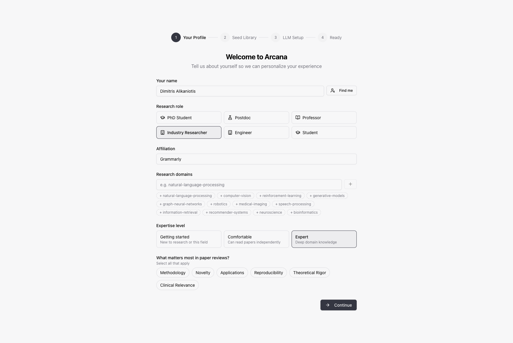
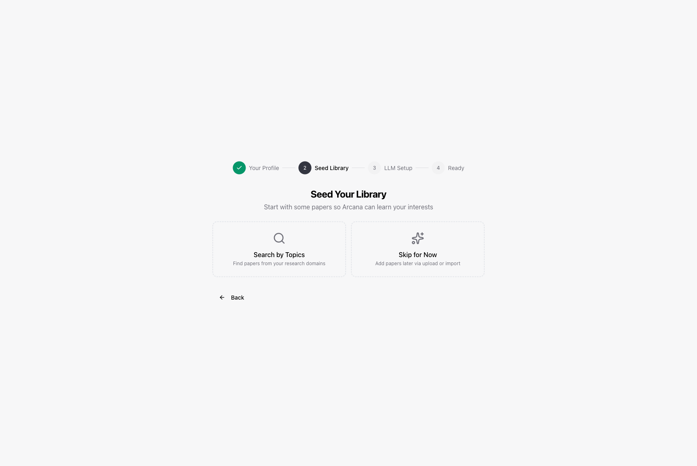
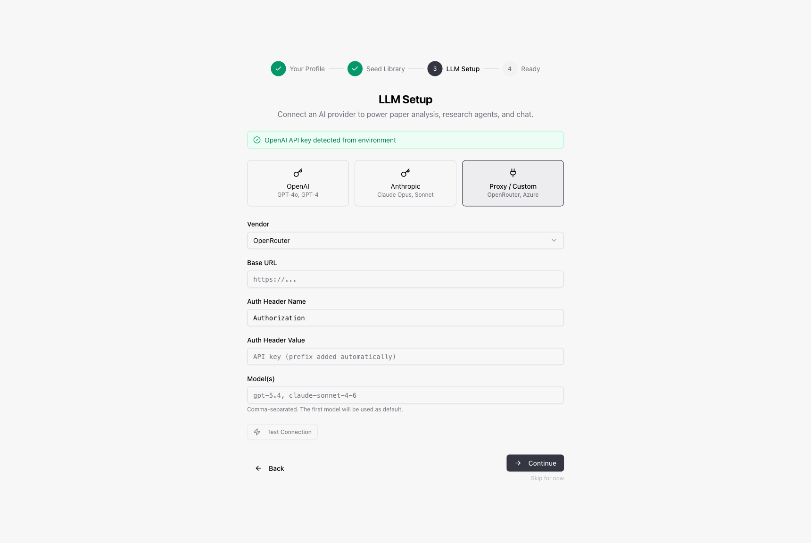
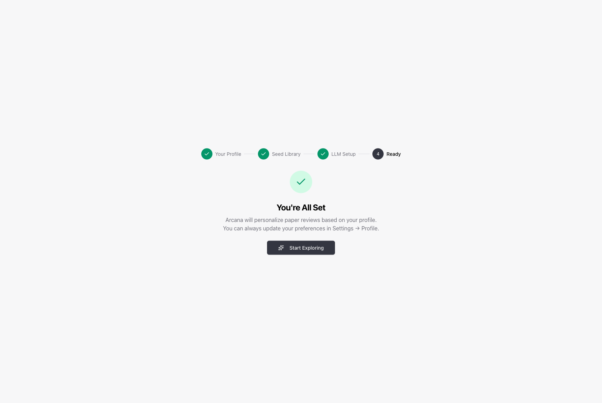

# Getting Started

This guide walks you through setting up Arcana from scratch. By the end, you'll have a working paper library and be ready to start autonomous research projects.

## Prerequisites

- **Node.js** 20+ and **npm**
- **Python 3.10+** (for remote experiment scripts)
- An LLM API key or proxy (OpenAI, Anthropic, or a compatible proxy like OpenRouter)

## Installation

```bash
git clone https://github.com/dimalik/paper_finder.git
cd paper_finder
npm install
cp .env.example .env    # Edit with your API keys
npx prisma migrate dev  # Create prisma/dev.db and apply migrations
npm run dev             # Start the development server
```

Open [http://localhost:3000](http://localhost:3000) in your browser.

If you already had a local `prisma/dev.db` that was advanced with `npx prisma db push` before the `20260410223000_research_platform_catchup` migration landed, do not run `prisma migrate deploy` against it first. Either:

```bash
npx prisma migrate resolve --applied 20260410223000_research_platform_catchup
```

or delete `prisma/dev.db` and rerun `npx prisma migrate dev` if you do not need the local data.

## Onboarding

The first time you sign in, Arcana guides you through a four-step setup wizard.

### Step 1: Your Profile



Tell Arcana about yourself so it can personalize paper reviews and recommendations:

- **Name** — used for author matching on Semantic Scholar
- **Research role** — PhD Student, Postdoc, Professor, Industry Researcher, Engineer, or Student
- **Affiliation** — your institution or company
- **Research domains** — click suggested topics or type your own (e.g., `natural-language-processing`, `reinforcement-learning`)
- **Expertise level** — affects the depth and tone of paper reviews
- **Review priorities** — what you value most: methodology, novelty, applications, reproducibility, etc.

Click **Find me** to auto-populate from your Semantic Scholar profile.

### Step 2: Seed Your Library



Start with a few papers so Arcana can learn your interests:

- **Search by Topics** — searches Semantic Scholar for papers in your research domains
- **Skip for Now** — add papers later via the library's import tools (arXiv, DOI, PDF upload, or the Chrome extension)

You can always import more papers after onboarding.

### Step 3: LLM Setup



Connect an AI provider. This powers paper analysis, research agents, chat, and auto-processing. Choose one:

| Provider | Best for | Models |
|----------|----------|--------|
| **OpenAI** | Direct API access | GPT-5.4, GPT-4.1, GPT-4o |
| **Anthropic** | Direct API access | Claude Opus 4.6, Claude Sonnet 4.6, Claude Haiku 4.5 |
| **Proxy / Custom** | Corporate proxies, OpenRouter, LiteLLM, Azure | Any OpenAI-compatible endpoint |

For **proxy** setups, select your vendor (OpenRouter, LiteLLM, Azure, or Custom) and the base URL / auth headers will be pre-filled. Enter your API key and the model IDs you want to use (comma-separated — the first becomes the default).

Click **Test Connection** to verify before continuing.

> **Tip:** If your organization uses an OpenAI-compatible endpoint, select "Proxy / Custom" and enter the base URL. You can also configure this in your `.env` file — Arcana will auto-detect it on startup.

If you skip this step, paper analysis, research agents, and chat won't work until you configure a provider in **Settings → LLM**.

### Step 4: Ready



You're all set. Click **Start Exploring** to enter the library.

## After Onboarding

### The Library

Your main workspace. Import papers from arXiv, DOI, URL, PDF upload, or the Chrome extension. Arcana automatically:
- Extracts full text from PDFs
- Generates AI summaries and key findings
- Extracts insights to the Mind Palace
- Tags papers by topic
- Discovers related papers

### Research Projects

Create autonomous research projects from **Research → New Project**. The agent follows a phase-gated workflow:

```
Literature → Hypothesis → Experiment → Analysis → Reflection
```

Each phase transition has enforced gates (minimum papers, hypotheses, architect proposals, etc.). See the [Research Agent docs](research-agent.md) for details.

### Research Dashboard


The project detail view shows:
- **Left panel** — Research narrative timeline (breakthroughs, experiments, decisions, reviews)
- **Right panel** — Tabbed: Status, Summary, Papers, Figures, Files, Chat

Keyboard shortcuts: `c` for chat, `Esc` for status, `` ` `` for console.

## Environment Variables

See `.env.example` for all available options:

| Variable | Required | Description |
|----------|----------|-------------|
| `DATABASE_URL` | No | SQLite path (default: `file:./dev.db`) |
| `OPENAI_API_KEY` | One of these | OpenAI API key |
| `ANTHROPIC_API_KEY` | One of these | Anthropic API key |
| `LLM_PROXY_URL` | One of these | OpenAI-compatible endpoint URL |
| `LLM_PROXY_HEADER_NAME` | With endpoint | Auth header name (default: `Authorization`) |
| `LLM_PROXY_HEADER_VALUE` | With endpoint | Auth header value |
| `S2_API_KEY` | No | Semantic Scholar API key (higher rate limits) |
| `CROSSREF_MAILTO` | No | Email for CrossRef API (polite access) |

## Next Steps

- [Architecture Overview](architecture.md) — system design and data flow
- [Research Agent](research-agent.md) — phase-gated workflow, tools, sub-agents
- [Remote Execution](remote-execution.md) — GPU server setup and SSH configuration
- [LLM Configuration](llm-configuration.md) — model tiers, proxy setup, cost tracking
- [API Reference](api-reference.md) — all REST endpoints
